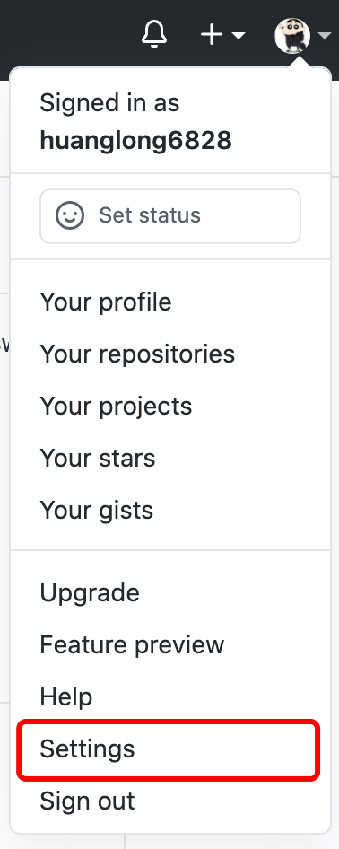
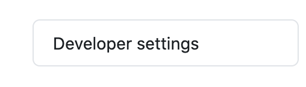
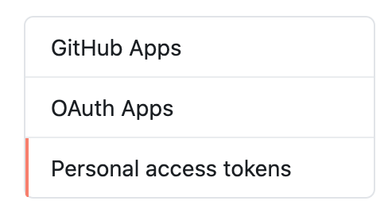
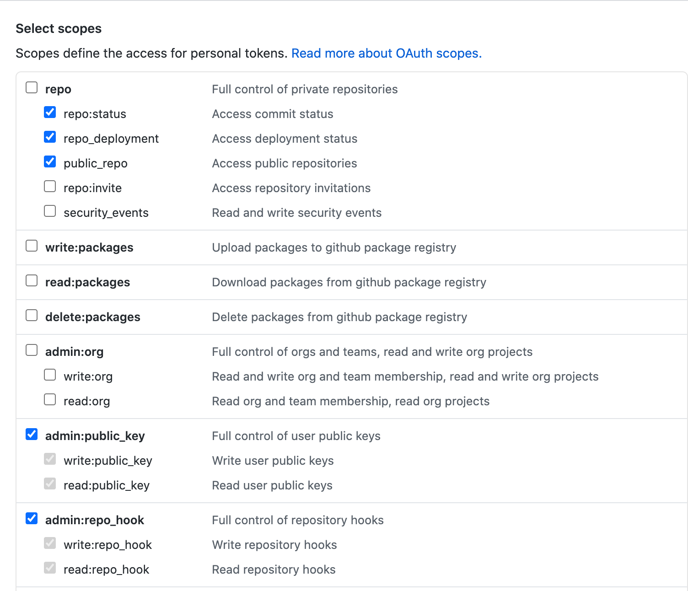
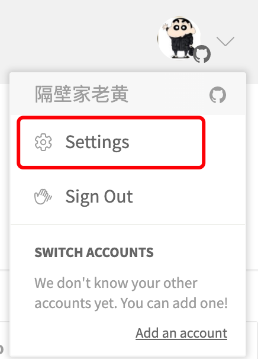
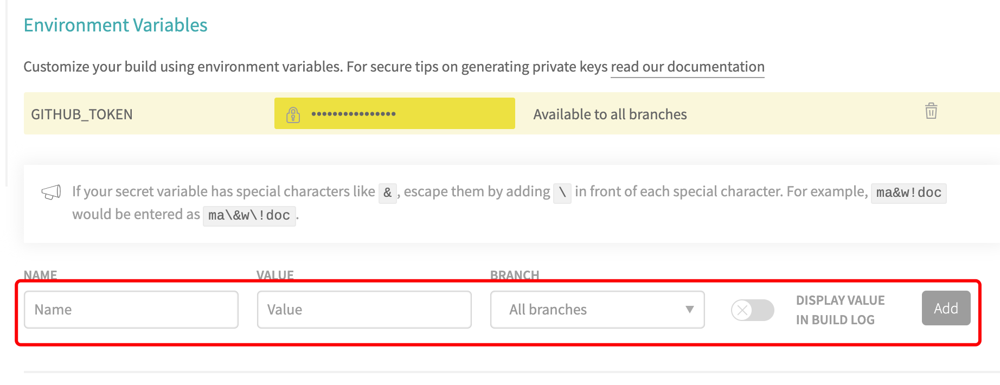

by [@huanglong](https://github.com/huanglong6828)

## 构建于

该项目基于以下开源技术构建：

- [Node.js](https://nodejs.org/)
- [VuePress](https://github.com/vuejs/vuepress)
- [vuepress-theme-api](https://github.com/sqrthree/vuepress-theme-api)
- [Travis Cl](https://travis-ci.org)
- [brew](https://brew.sh/)

## 环境依赖

在开始使用本项目之前，请确保安装有以上环境。

- [Node.js](https://nodejs.org/)
- [VuePress](https://github.com/vuejs/vuepress)
- [vuepress-theme-api](https://github.com/sqrthree/vuepress-theme-api)
如果你已经有了 [Node.js](https://nodejs.org/)环境，可以通过以下命令安装 `VuePress` 、 `vuepress-theme-api`。

```bash
# 安装 vuepress
yarn global add vuepress # OR npm install -g vuepress

# 安装主题
yarn global add vuepress-theme-api # OR npm install -g vuepress-theme-api

# 启动
vuepress dev

# 构建静态文件
vuepress build

```

## 自动化部署

配置Travis Cl

github在必须从master分支构建。那么我们调整思路，新增一个source分支为代码存储分支，master为构建分支。


```yml
language: node_js
node_js:
- lts/*
script:
- yarn docs:build
deploy:
  provider: pages
  skip-cleanup: true
  local_dir: docs/.vuepress/dist
  github-token:$GITHUB_TOKEN
  target-branch: master
  keep-history: true
  on:
    branch: source
```

### 创建github token

#### 步骤一



#### 步骤二



#### 步骤三



#### 步骤四



### Travis Cl 关联

#### 步骤一



#### 步骤二


#### 步骤三



### 加密github token

如果不加密，打包发布一次后，github会自动删除当前token，同时也不安全。

- 安装travis

```bash
brew install travis
```

- 确保在 [travis cl](https://travis-ci.org/) sign in with github
- 然后在项目根目录里，执行命令

```bash
travis login —auto
```

- 修改git设置

```bash
vi .git/config
```

- 确保

```bash
[travis]
  slug = 是你在travis关联的仓库
```

- 添加加密环境变量

```bash
[travis]
travis encrypt github-token=xxx --add deploy.github-token
```

### 加密后

```yml
language: node_js
node_js:
- lts/*
script:
- yarn docs:build
deploy:
  provider: pages
  skip-cleanup: true
  local_dir: docs/.vuepress/dist
  github-token:
    secure: 你加密后的key
  target-branch: master
  keep-history: true
  on:
    branch: sources
```
