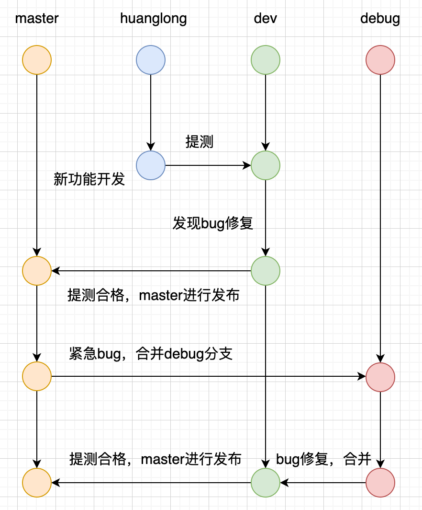

by [@huanglong](https://github.com/huanglong6828)

个人推荐git可视化工具 [sourcetree](https://www.sourcetreeapp.com/)

## 分支命名

  主要分为`master`、`develop`、`debug`、`userName`

### master: 主分支

- master 为主分支，也是用于部署生产环境的分支，master 分支要确保稳定性

- master 分支一般由 dev 以及 debug 分支合并，任何时间都不能直接修改代码

### dev: 开发分支

- dev 为开发分支，始终保持最新完成以及bug修复后的代码

- 当我们在 userName 分支开发完毕后要将代码提交到 dev 分支，dev 的代码将发布到测试环境供测试人员测试。

### debug: 补丁分支

- 线上出现紧急问题时，以 master 分支为基线，合并 debug 分支。用于需要及时修复，修复完成后，需要合并到 dev 分支

### userName: 开发人员独立分支

- 模块化开发功能，开发完毕后合并到 dev 分支，然后发布测试环境供测试人员测试。
- 自分支命名: 如：huanglong 为特性分支。

## 提交流程

1. 1、当有功能开发完成，首先 userName 分支会合并到 dev 分支，进入提测。

2. 2、如果测试过程中存在 bug 需要修复，则直接由开发者在 dev 分支修复并提交。

3. 3、当测试完成之后，合并 dev 分支到 master 分支，此时 master 为最新代码，用作上线。

4. 4、出现紧急bug时，合并 master 分支到 debug 分支。重新走123流程

  

## 提交规范

  Git 每次提交代码，都要写 Commit message（提交说明），否则就不允许提交，这其实就是规范，但输入的说明我们可以随便写。

  ````js

    ✨feat：新功能
    🚑fix：修补bug
    📚docs：修改文档
    🎨style： 格式化代码结构，没有逻辑上的代码修改
    🚜refactor：重构，即不是新增功能，也不是修改bug的代码变动，比如重命名变量
    🔬test：增加测试代码，单元测试一类的，没有生产代码的变更
    chore：构建过程或辅助工具的变动（不会影响代码运行）

  ````

## 总结

以上规范不一定是必须的，一般是根据实际情况来的，总结下自己工作中的一些问题

- 自己的分支一定要自测，切记不要提交后，影响到其他代码，更别说别人拉下代码还报错这种低级错误
- 本地分支要做到勤提交，分小功能提交，一次提交一大堆各种功能的做法也要杜绝
- 每天第一件事就是更新 develop 分支内容到本地分支，避免大规模 merge，太容易出错了
- 迭代新版本时，一定要保证当前开发分支和线上分支一样
