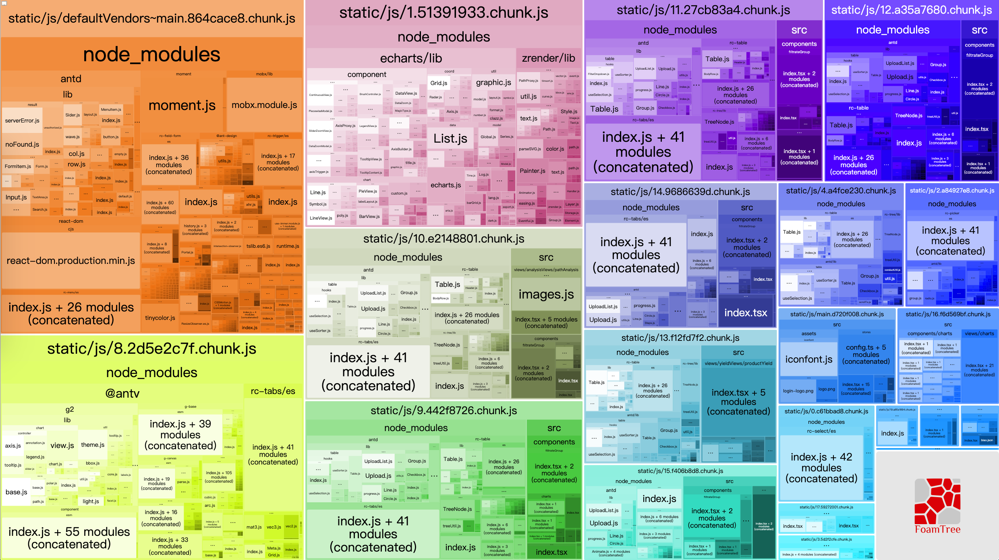
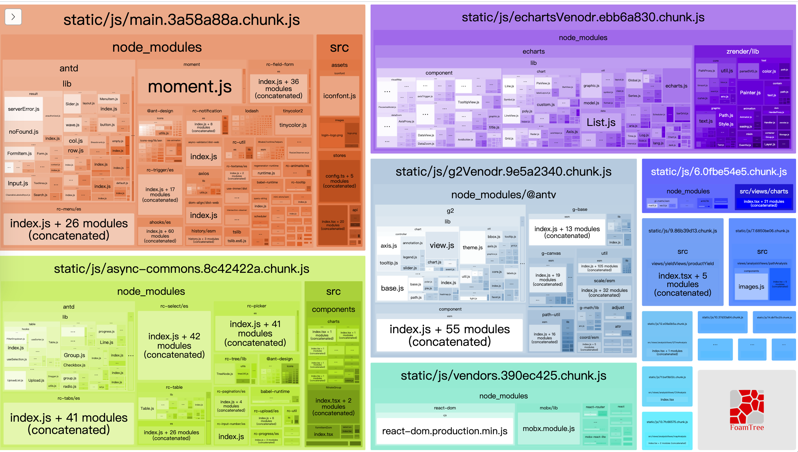

by [@huanglong](https://github.com/huanglong6828)

本文讲解的是使用[create-react-app](https://www.html.cn/create-react-app/)搭建的项目,不eject下进行自定义配置webpack优化。

楼主使用的是[craco](https://github.com/gsoft-inc/craco),相关文档自行查看学习。

项目依赖库：

- react antd mobx 作为基础库
- echarts @antv/g2 图表库
- 其他业务代码

## webpack4

webpack4在启动和打包的效率在以前版本有很大的提升，但是打包优化并没有什么固定的模式，一般我们常见的优化就是拆包、分块、压缩等，并不是对每一个项目都适用，针对于特定项目，需要不断调试不断优化。

### SplitChunksPlugin 拆包

#### chunks

- all: 不管文件是动态还是非动态载入，统一将文件分离。当页面首次载入会引入所有的包
- async： 将异步加载的文件分离，首次一般不引入，到需要异步引入的组件才会引入。
- initial：将异步和非异步的文件分离，如果一个文件被异步引入也被非异步引入，那它会被打包两次（注意和all区别），用于分离页面首次需要加载的包。

#### minSize

文件最小打包体积，单位byte，默认30000

比如说某个项目下有三个入口文件，a.js和b.js和c.js都是100byte，当我们将minSize设置为301,那么webpack就会将他们打包成一个包，不会将他们拆分成为多个包。

#### maxSize

表示抽取出来的文件在压缩前的最大大小，默认为 0，表示不限制最大大小；

#### minChunks

最少引入的次数

#### maxInitialRequests

入口点处的最大并行请求数，默认为3

如果我们设置为1，那么每个入口文件就只会打包成为一个文件

#### maxAsyncRequests

最大异步请求数量，默认5

如果我们设置为1，那么每个入口文件就只会打包成为一个文件

#### automaticNameDelimiter

连接符

假设我们生成了一个公用文件名字叫vendor，a.js,和b.js都依赖他，并且我们设置的连接符是"~"那么，最终生成的就是 vendor~a~b.js

#### 优先级关系

maxInitialRequest / maxAsyncRequests < maxSize < minSize

#### name

抽取出来文件的名字，默认为 true，表示自动生成文件名；

#### cacheGroups (重点)

缓存组。（这才是配置的关键）

定制分割包的规则

上面的那么多参数，其实都可以不用管，cacheGroups 才是我们配置的关键。它可以继承/覆盖上面 splitChunks 中所有的参数值，除此之外还额外提供了三个配置，分别为：test, priority 和 reuseExistingChunk。

##### test

表示要过滤 node_modules，默认为所有的 node_modules，可匹配模块路径或 chunk 名字，当匹配的是 chunk 名字的时候，其里面的所有 node_modules 都会选中；

##### priority (非常重要)

表示抽取权重，数字越大表示优先级越高。因为一个 node_modules 可能会满足多个 cacheGroups 的条件，那么抽取到哪个就由权重最高的说了算；

##### reuseExistingChunk

表示是否使用已有的 chunk，如果为 true 则表示如果当前的 chunk 包含的模块已经被抽取出去了，那么将不会重新生成新的。

### 默认配置

```js
const { when, whenDev, whenProd, whenTest, ESLINT_MODES, POSTCSS_MODES } = require("@craco/craco");

module.exports = {
  ...
  webpack: {
    alias: {},
    plugins: [],
    configure: {
      optimization: {
      splitChunks: {
        chunks: 'all', // initial、async和all
        minSize: 30000, // 形成一个新代码块最小的体积
        maxAsyncRequests: 5, // 按需加载时候最大的并行请求数
        maxInitialRequests: 3, // 最大初始化请求数
        automaticNameDelimiter: '~', // 打包分割符
        name: true,
        cacheGroups: {
          defaultVendors: {
            test: /[\\/]node_modules[\\/]/,
            priority: -10
          },
          default: {
            minChunks: 2,
            priority: -20,
            reuseExistingChunk: true
          }
        }
      }
    }
    }
  }
};

```

打包后包分析图：



很明显我们发现了很多问题：

- 其实当我们进入网站，一般第一步都是进入一个登陆页面，需要的只是项目的基本框架代码，例如react,react-dom,antd等，我们可以用all(或者initial)将它们单独打包，作为首页必须载入的包

- 我们打包的公共包，首次加载页面的时候，只想把同步加载的加载进来，所以需要一个同步的Common包

- 像echarts,g2,以及一些src下面一些异步加载的包，将它们利用async将打包成一个独立异步加载包

- rc-table等，重复打包引用次数太多

### 修改 cacheGroups

根据以上问题，我们做如下修改：

- 设置priority 权重：vendors>async-commons>commons避免打包过的react等又重复打包到其中
- echarts/g2等单独打包异步引入

```js
module.exports = {
  ...
  webpack: {
    alias: {},
    plugins: [],
    configure: {
      optimization: {
      splitChunks: {
        chunks: 'all', // initial、async和all
        minSize: 30000, // 形成一个新代码块最小的体积
        maxAsyncRequests: 5, // 按需加载时候最大的并行请求数
        maxInitialRequests: 3, // 最大初始化请求数
        automaticNameDelimiter: '~', // 打包分割符
        name: true,
        cacheGroups: {
            vendors: { // 基本框架
              chunks: 'all',
              test: /(react|react-dom|react-dom-router|babel-polyfill|mobx)/,
              priority: 100,
              name: 'vendors',
            },
            g2Venodr: { // 将体积较大的g2单独提取包，指定页面需要的时候再异步加载
              test: /@antv/,
              priority: 100, // 设置高于async-commons，避免打包到async-common中
              name: 'g2Venodr',
              chunks: 'async'
            },
            echartsVenodr: { // 异步加载echarts包
              test: /(echarts|zrender)/,
              priority: 100, // 高于async-commons优先级
              name: 'echartsVenodr',
              chunks: 'async'
            },
            'async-commons': { // 其余异步加载包
              chunks: 'async',
              minChunks: 2,
              name: 'async-commons',
              priority: 90,
            },
            commons: { // 其余同步加载包
              chunks: 'all',
              minChunks: 2,
              name: 'commons',
              priority: 80,
            }
          }
        }
      }
    }
    }
  }
};

```

调整后分析图:



## 总结

- 避免重复引用，导致包过大.
- 根据不同情况进行拆分.
- priority计算清楚，否则导致打包混乱.
